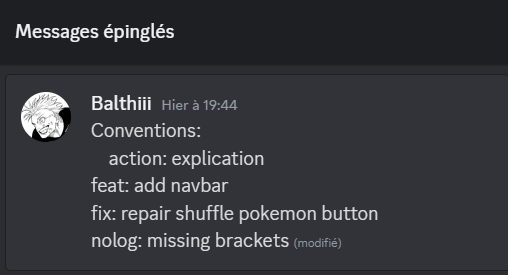

# PokeApp API

PokeApp API is a web application that allows users to view and manage Pokémon information using the PokeAPI. The application includes features such as generating random Pokémon, viewing a complete list of Pokémon, managing a list of favorite Pokémon, and toggling between a dark mode and light mode.

## Team Members

| Full Name          | Email Address                    | Role          |
| ------------------ | -------------------------------- | ------------- |
| KONG A SIOU Swan   | swankong1@gmail.com              | Product Owner |
| VAILLANT Balthazar | balthasalaise@gmail.com          | Senior Dev    |
| GIRARDET Maxime    | maxime.girardet@ecole-isitech.fr | Junior Dev    |
| MATHIEUX Yohann    | yohann.mathieux@ecole-isitech.fr | Junior Dev    |

## Note of Intent

### Technical Choices Justification

We chose **React** with **Vite.js** for its speed and ease of integration with **TypeScript**, providing static typing and better error handling. For routing, we used **react-router-dom** to enable smooth navigation between different pages of the application. The dark/light mode switch was implemented using React state and dynamic CSS classes, enhancing the user experience by offering a visually adaptable interface.

### Project Review

**Challenges Encountered:**

- **Merge Conflicts:** We faced several merge conflicts when integrating the Navbar feature with the dark/light mode feature.
- **Dark Mode Styling:** Adjusting multiple elements to ensure good contrast and optimal readability in dark mode was challenging.

**Solutions Implemented:**

- We resolved merge conflicts by carefully reviewing each conflict and communicating closely within the team to make decisions on how to resolve them.
- For dark mode, we implemented CSS transitions to smooth the theme change and used specific colors for each theme to ensure a consistent user experience.

### Additional Information

The application is deployed on Vercel, providing easy access and continuous updates through a continuous integration (CI) pipeline configured with GitHub Actions. This pipeline ensures that all features are tested before being deployed to production.

## Getting Started

Welcome to the `PokeApp API` development environment setup guide. This document provides comprehensive instructions to facilitate a smooth and consistent setup across various development environments.

### Dependency Installation

To install the project's dependencies, run the following command:

```bash
npm install
```

### Running the Application

To start the application in development mode, run:

```bash
npm run dev
```

The application will be accessible at http://localhost:5173.

### Challenges Encountered

During the development of PokeApp API, one of the key challenges we faced was related to communication and understanding within the team. At times, there were misunderstandings regarding certain aspects of the project, which led to some delays and confusion, especially when it came to adhering to the conventions we had set, such as the commit message guidelines.

### Solutions Implemented

To address these issues, we created a dedicated Discord group for our team. This platform allowed us to streamline our communication and ensure that everyone was on the same page. We utilized Discord’s feature to pin important messages, which became a valuable tool for maintaining clarity.

For example, we pinned a detailed explanation of our commit message convention. This ensured that all team members could easily refer to it whenever needed, leading to a more consistent and organized commit history. By centralizing our communication and making key decisions readily accessible, we significantly improved our collaboration and overall workflow.


